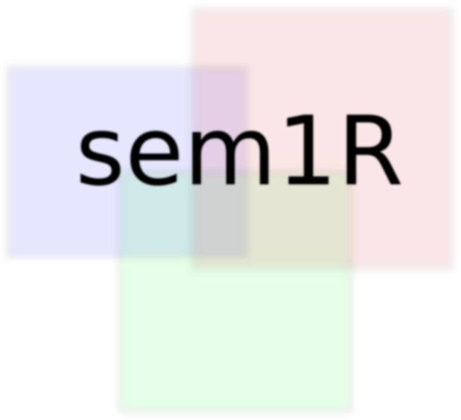

# sem1R - Concept single rule learning with an ontology-based refinement operator


<p style="text-align: justify">sem1R is a machine learning algorithm that finds interesting, hidden, and non-trivial patterns in omics data. The algorithm produces a set of semantical prediction rules that form data into clusters or biclusters, this depends on a type of ontologies. Here, we distingues between two types of ontologies: an ontology describing rows (e.g. genes) an columns (e.g. samples). Practically, for gene expression data, where rows represent genes and column represent samples, we recommend to use Gene ontology or any pathway ontologies as a row ontology. Choosing a proper column ontology is depending on a type of experiment, e.g. OBO Foundry provides almost two hundreds and many of them are domain specific so some anatomical ontologies can be used as well.

The sem1R is based on rule learning methods, where two reduction procedures were added and that make the algorithm extremely fast and efficient in comparison with traditional approach. In additional, it is relative easy to use, because all important methods are included into the package.</p>

## Getting Started
The algorithm is implemented in C++ and provided as `R` package. The following instructions will show you how to install all prerequisites and the sem1R package as well into your local machine. Afterwards, we will demonstrate the sem1R on real gene expression dataset.

### Prerequisites
We required to use R in version 3.0.2.
All prerequisites R packages that are needed for the sem1R package are the following:
`Rcpp (>= 0.12.6)`, `RcppProgress`, `RcppArmadillo (>= 0.7.800.2.0)`, and `BH (>= 1.72.0-3)`. All of these packages come from CRAN, so install them by `install.packages` function in R.

Or, for easier installation we recommend to install 'devtools' that can download and install the project instantly from gitHub using only one command.

For installing 'devtools' package run `R` and type the following:
```
install.packages("devtools")
```

### Installing
If you choosen instalation via devtools, you would go to the terminal and run `R` and then the following commands:

```
library(devtools)
install_gitHub("fmalinka/sem1R")
```
All prerequisites packages should be installed automatically.

For non-devtools users, download the sem1R package and extract it to your arbitrary folder.
Run the terminal, go to the folder that you have already choosen and install all prerequisities if you have not installed yet using `install.packages` R's function. Go to the folder and build the package.

```
cd /my/path/to/package
R CMD build .
```
The package in tar.gz format will be named as `sem1R_version.tar.gz'.
Then, install the sem1R package.

```
R CMD INSTALL sem1R_version.tar.gz
```

And finally, check whether the sem1R package was installed.
Run R and load the package.
```
library(sem1R)
```


## Running the example
Running example that we present here comes from [1] and shows a gene expression over Drosophila melanogaster imaginal discs. All necessary files for this example are located at [example](example) folder.

### Data matrix
A file [discMatrix.csv](example/discMatrix.csv) contains binary information about gene expression over imaginal discs of Drosophila melanogaster. The matrix is two-dimensional where rows represent genes and columns represent samples (locations). Each dimension has own identifier, i.e. genes are described by FBgn (FlyBase) identifiers and columns by your notation. Ones in the matrix mean "expressed" and zeros mean "non-expressed" in the given positions. Obviously, process of binarization has to be done if your data are not in the binary format.

### Ontologies
Ontologies are the second type of input that has to be given to your algorithm. Ontology has to be in OBO format (https://owlcollab.github.io/oboformat/doc/GO.format.obo-1_4.html) and relationships of terms must be acyclic. For many interesting ontologies look at OBO Foundry (http://obofoundry.org/). In our running example, we provide two type of different ontologies. Gene ontology, located at [example/go-basic.obo](example/go-basic.obo), aims to rows of the data matrix and FBBT ontology (http://obofoundry.org/ontology/fbbt.html), located at [example/fbbt-simple.obo](example/fbbt-simple.obo), focuses on the columns.

### Connection between the data matrix and the ontologies

### Run sem1R

```
library(sem1R)
mysem1R <- new(sem1R)
mydata <- read.csv("example/discMatrix.csv", header = TRUE, check.names = FALSE, row.names = 1)
mydata <- as.matrix(mydata)
#get onto Desc
ontoDesc <- PrepareOntologyDesc(mydata, geneASOC = "example/gene_association.fb", colCSV = "example/initsegmentFBbtWithoutComments.csv")

#library(lattice)
#levelplot(as.matrix(mydata))

mysem1R$setDataset(mydata)
#load Ontology
rowOntoPath <- "example/go-basic.obo"
colOntoPath <- "example/fbbt-simple.obo"
mysem1R$createCOLOntology("FBGN", colOntoPath, ontoDesc$col)
mysem1R$createROWOntology("GO", rowOntoPath, ontoDesc$row)

mysem1R$ruleFormat <- "both"

mysem1R$filterTh <- 100
mysem1R$objective <- "auc"

mysem1R$ruleDepth <- 9
mysem1R$nrules <- 10
mysem1R$featureSelectionMethod <- 0
mysem1R$minLevel <- 3
myhypothesis <- mysem1R$findDescription()
```

The source code fo this example you can find at [example_disc_auc.R](example_disc_auc.R).

## Authors

* **František Malinka** - *Initial work*

## License

This project is licensed under the MIT License.

## Acknowledgments

* Hat tip to anyone whose code was used
* Inspiration
* etc


